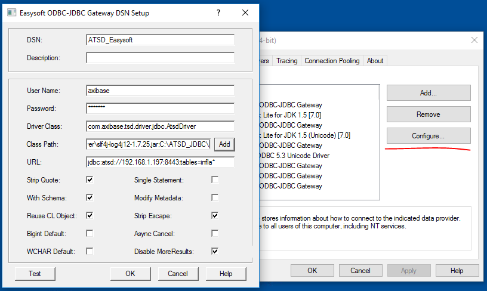

## Tracing and Logging

The ATSD JDBC driver uses [SLF4J](https://www.slf4j.org/) for its internal logging, but leaves underlying log implementation open. Default configuration redirects all logging messages to the NO-OP appender.
You may use any logging library supported by SLF4J, but in the examples we will be using log4j. You may need to prepare the [log4j library](http://central.maven.org/maven2/log4j/log4j/1.2.17/log4j-1.2.17.jar) and [slf4j-log4j binding](http://central.maven.org/maven2/org/slf4j/slf4j-log4j12/1.7.25/slf4j-log4j12-1.7.25.jar)

### Enabling logging for applications with configured SLF4J logging

To turn on logging for particular ATSD JDBC methods, you need to configure appenders for ATSD JDBC driver classes in the existing logging configuration.

Let's take [SQuirrel SQL](http://www.squirrelsql.org/) client as an example. Open the file $SQUIRREL_HOME/log4j.properties and add the following lines that will allow output of ATSD JDBC driver tracing messages to the `atsd_jdbc.log` file in the user's home directory:

```
log4j.appender.file=org.apache.log4j.RollingFileAppender
log4j.appender.file.File=${user.home}/atsd_jdbc.log
log4j.appender.file.MaxFileSize=10MB
log4j.appender.file.MaxBackupIndex=10
log4j.appender.file.layout=org.apache.log4j.PatternLayout
log4j.appender.file.layout.ConversionPattern=%d{yyyy-MM-dd HH:mm:ss} %-5p %c{1}:%L - %m%n

log4j.logger.com.axibase.tsd.driver.jdbc=TRACE, file
```

### Enabling logging for applications without configured SLF4J logging

Some tools either do not use SLF4J or execute the driver's code in an isolated process. To enable logging in this case, you need to provide a logging framework library jar (if absent) and [slf4j bindings](https://www.slf4j.org/manual.html#swapping).

Let's see how to put log4j to classpath to enable logging with the [DataGrip](https://www.jetbrains.com/datagrip/) tool.

Assume that ATSD JDBC driver, necessary logging dependencies, and logging configuration are put into /opt/atsd_jdbc directory.
Create ATSD JDBC driver configuration in DataGrip.


Create a driver connection.


Provide a path to the logging configuration in the VM Option text bar.


### Enabling logging for ODBC-JDBC bridge

For this example we will be using the Easysoft ODBC-JDBC bridge. To install and configure it for work with the ATSD JDBC driver, follow the instructions [here](https://github.com/axibase/atsd/blob/master/integration/odbc/README.md).

You need to prepare logging framework and SLF4J binding library dependencies. Let's put the ATSD JDBC driver and logging dependencies in the C:\JDBC_Driver directory.
Create a log4j.properties file in the C:\JDBC_Driver directory with the following content:

```
# Root logger option
log4j.rootLogger=TRACE, file

# Direct log messages to a log file
log4j.appender.file=org.apache.log4j.RollingFileAppender

log4j.appender.file.File=C:\JDBC.log
log4j.appender.file.MaxFileSize=10MB
log4j.appender.file.MaxBackupIndex=10
log4j.appender.file.layout=org.apache.log4j.PatternLayout
log4j.appender.file.layout.ConversionPattern=%d{yyyy-MM-dd HH:mm:ss} %t %-5p %c{1}:%L - %m%n
```
This will allow the output of all driver trace messages to C:\JDBC.log file.

Run the ODBC Data Sources and choose the configured ATSD Gateway. Change the classpath by adding logging dependencies and directory.


Copy the classpath. Create a CLASSPATH environment variable and paste the value.


